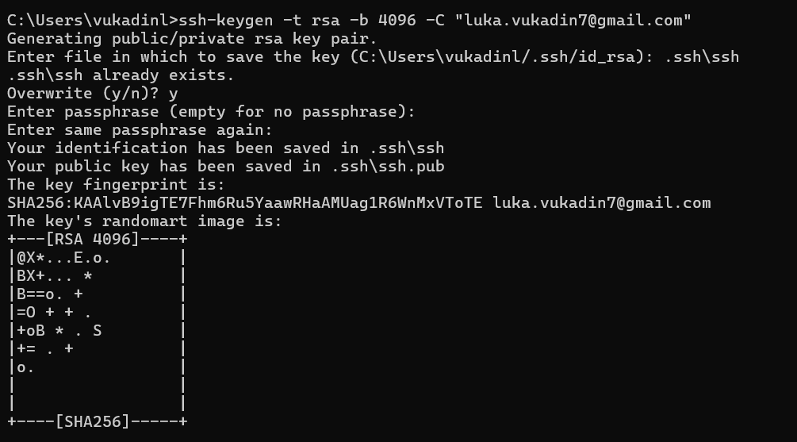
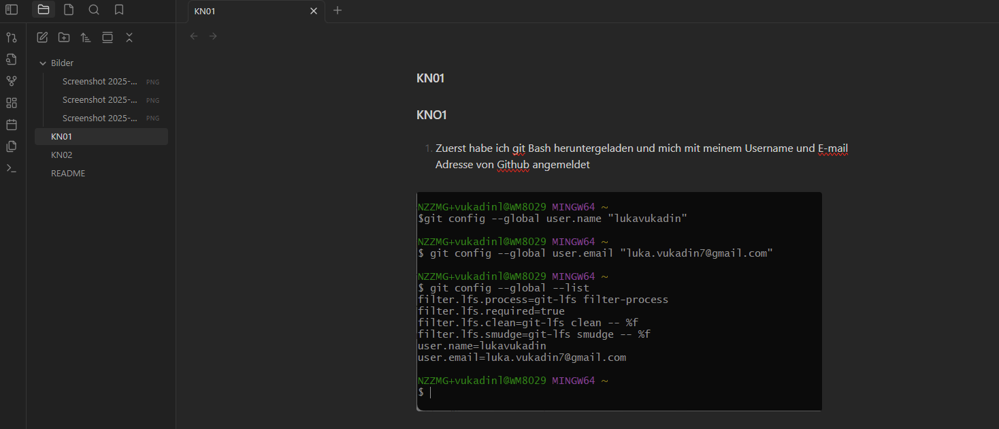

# KN01 -  Toolumgebung aufsetzen

1. Zuerst habe ich git Bash heruntergeladen und mich mit meinem Username und E-mail Adresse von Github angemeldet


---

2. Dann habe ich eine Private-/Public Key erstellt.



---

3. Dann habe ich auf Git bash einen skript im File .bash_profile hinzugefügt, damit ich nicht jedes mal den passphrase eingeben muss.

```
env=~/.ssh/agent.env
agent_load_env () { test -f "$env" && . "$env" >| /dev/null ; }

agent_start () {
  (umask 077; ssh-agent >| "$env")
  . "$env" >| /dev/null ; }

agent_load_env

# agent_run_state: 0=agent running w/ key; 1=agent w/o key; 2=agent not running
agent_run_state=$(ssh-add -l >| /dev/null 2>&1; echo $?)

if [ ! "$SSH_AUTH_SOCK" ] || [ $agent_run_state = 2 ]; then
  agent_start
  ssh-add
elif [ "$SSH_AUTH_SOCK" ] && [ $agent_run_state = 1 ]; then
  ssh-add
fi

unset env

```

---

4. Dannach ging ich auf github und habe den Public Key hinzugefügt und habe die verbindung über Git bash getestet.


---

5. Dann habe ich ein Repository heruntergeladen und zwar Obsidian. Damit ich Obsidian verwenden kann habe ich zuerst das Repository von diesem Modul was auf der Cloud von Github ist hinzugefügt unter dem Ordner Dokumente Lokal.





6. Jetzt habe ich versucht das Repository Lokal zu commiten und zu Pushen und dies war erfolgreich.
