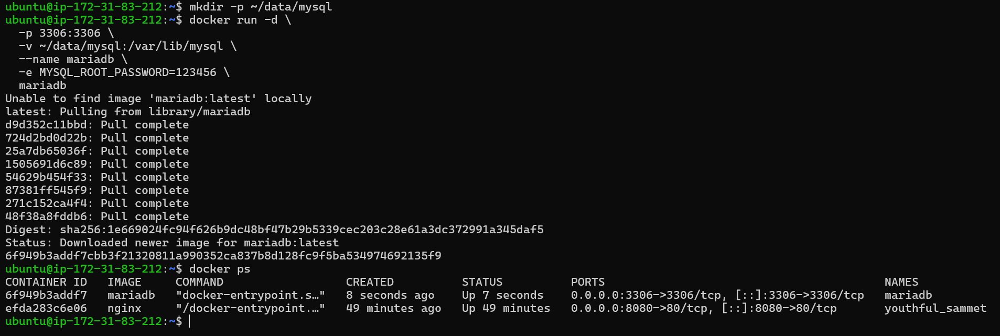

# KN03 - Infrastruktur Automatisierung


### 🟢 1. Teil-Challenge - Aufsetzen der EC2-Instanz mit IaC-Code - AWS LEARNER LAB


###### 1. Als erstes habe ich die EC2 Instance erstellt :


So sieht der Cloud-Init Code aus mit der ich die Instance gestartet habe:

```
#cloud-config
packages:
  - apt-transport-https
  - ca-certificates
  - curl
  - gnupg-agent
  - software-properties-common
# Sorgt dafür, dass auf dem Zielsystem das IPv4-Forwarding aktiviert wird, was häufig auf Routern oder in Netzwerkkonfigurationen benötigt wird, die als Gateway dienen
write_files:
  - path: /etc/sysctl.d/enabled_ipv4_forwarding.conf
    content: |
      net.ipv4.conf.all.forwarding=1
groups:
  - docker
# Install Docker and Podman: fixieren auf stabile Versionen
runcmd:
  - curl -fsSL https://download.docker.com/linux/ubuntu/gpg | apt-key add -
  - add-apt-repository "deb [arch=amd64] https://download.docker.com/linux/ubuntu $(lsb_release -cs) stable"
  - apt-get update -y
  - apt-get install -y docker-ce docker-ce-cli containerd.io
  - systemctl start docker
  - systemctl enable docker
  - apt-get install podman -y
  - systemctl start podman
  - systemctl enable podman
  - usermod -aG docker ubuntu
```


###### 2. Hier sieht man die erfolgreiche Verbindung mit dem SSH schlüssel:


`docker --version` und `systemctl sttus docker` ausgeführt:


`podman --version` und `systemctl status podman` ausgeführt:


---


### 🟢 2. Teil-Challenge - OCI-Images, Container und Registry - BASICS


1. Hello-World

- Ergebnis: Docker läuft korrekt
- Container wurde aus dem offiziellen Image gestartet
- Testausgabe bestätigt funktionierende Installation


2. Docker image

Erklärung:

- `docker image ls`: zeigt alle heruntergeladenen Images
- `docker ps`: zeigt aktuell **laufende** Container
- `docker ps -a`: zeigt **alle** Container (inkl. beendeter)


3. NGINX

Erklärung:

- `-d`: startet den Container im Hintergrund (detached mode)
- `-p 8080:80`: mappt Port 80 im Container auf Port 8080 auf dem Host
- `nginx`: verwendet das Image `nginx:latest` aus der offiziellen Docker Registry


3. Am anfang hat es nicht funktioniert, weil ich den port 8080 in meiner Sciherheitsgruppe nicht als regel erstellt habe die verbindung durch zu lassen:


4. Die Verbindung mit dem NGINX Server hat funktioniert!:


### 📌 **Grundlegende Docker-Befehle**

| Befehl             | Erklärung                                     |
| ------------------ | --------------------------------------------- |
| `docker run`       | Startet einen neuen Container aus einem Image |
| `docker ps`        | Zeigt aktuell laufende Container              |
| `docker ps -a`     | Zeigt alle Container (auch bereits beendete)  |
| `docker stop <ID>` | Stoppt einen laufenden Container              |
| `docker rm <ID>`   | Löscht einen gestoppten Container             |
| `docker image ls`  | Listet lokal gespeicherte Images auf          |


### Docker vs. Virtuelle Maschine (VM)**

| **Docker Container**                        | **Virtuelle Maschine (VM)**                      |
| ------------------------------------------- | ------------------------------------------------ |
| Läuft auf dem Host-Kernel (leichtgewichtig) | Hat ein eigenes Betriebssystem (schwergewichtig) |
| Startet in Sekunden                         | Startet in Minuten                               |
| Teilt Ressourcen effizient                  | Reserviert Ressourcen fix                        |
| Weniger Overhead                            | Mehr Overhead durch Hypervisor                   |
| Isoliert über Namespaces                    | Isoliert durch Virtualisierungsschicht           |


### **Isolation von Containern – Vorteile**

- Jeder Container ist **isoliert** vom Host und von anderen Containern.

- Dadurch entstehen:
    
    - **Mehr Sicherheit**
        
    - **Weniger Konflikte** bei Abhängigkeiten (z. B. verschiedene Python-Versionen)
        
    - **Bessere Portabilität** – ein Container läuft überall gleich
        
    - **Schnelleres Debugging und Testing**


## Bonus-Credit: Zugriff auf laufenden NGINX-Webserver

Ich habe den NGINX-Container erfolgreich mit folgendem Befehl gestartet:

`docker run -d -p 8080:80 nginx`


----

### 🟢 3. Teil-Challenge - OCI-Images mit Docker - RUN & ADMINISTRATION

### **Schritt 1: Volume-Verzeichnis vorbereiten**

Wir erstellen ein Verzeichnis auf deiner EC2-Instanz, wo die Datenbankdaten gespeichert werden:

`mkdir -p ~/data/mysql`




