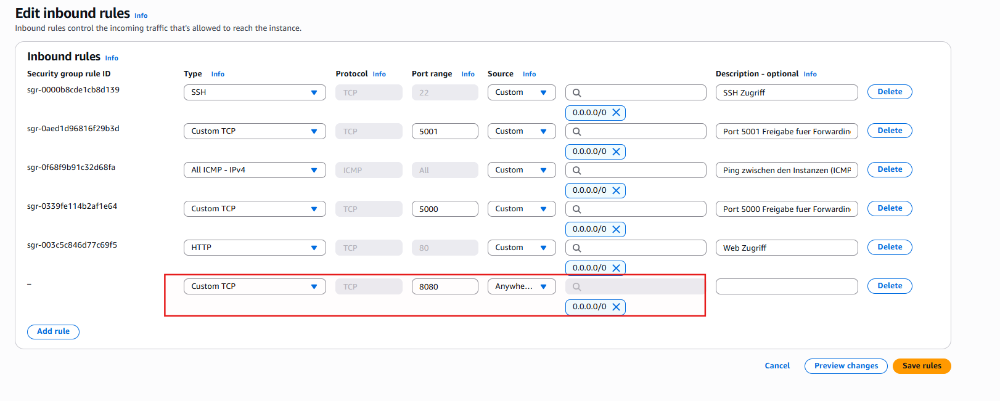

# KN03 - Infrastruktur Automatisierung


## 🟢 1. Teil-Challenge - Aufsetzen der EC2-Instanz mit IaC-Code - AWS LEARNER LAB


1. Als erstes habe ich die EC2 Instance erstellt :


So sieht der Cloud-Init Code aus mit der ich die Instance gestartet habe:

```
#cloud-config
packages:
  - apt-transport-https
  - ca-certificates
  - curl
  - gnupg-agent
  - software-properties-common
# Sorgt dafür, dass auf dem Zielsystem das IPv4-Forwarding aktiviert wird, was häufig auf Routern oder in Netzwerkkonfigurationen benötigt wird, die als Gateway dienen
write_files:
  - path: /etc/sysctl.d/enabled_ipv4_forwarding.conf
    content: |
      net.ipv4.conf.all.forwarding=1
groups:
  - docker
# Install Docker and Podman: fixieren auf stabile Versionen
runcmd:
  - curl -fsSL https://download.docker.com/linux/ubuntu/gpg | apt-key add -
  - add-apt-repository "deb [arch=amd64] https://download.docker.com/linux/ubuntu $(lsb_release -cs) stable"
  - apt-get update -y
  - apt-get install -y docker-ce docker-ce-cli containerd.io
  - systemctl start docker
  - systemctl enable docker
  - apt-get install podman -y
  - systemctl start podman
  - systemctl enable podman
  - usermod -aG docker ubuntu
```


2. Hier sieht man die erfolgreiche Verbindung mit dem SSH schlüssel:


`docker --version` und `systemctl sttus docker` ausgeführt:


`podman --version` und `systemctl status podman` ausgeführt:


---


## 🟢 2. Teil-Challenge - OCI-Images, Container und Registry - BASICS


1. Hello-World

- Ergebnis: Docker läuft korrekt
- Container wurde aus dem offiziellen Image gestartet
- Testausgabe bestätigt funktionierende Installation


2. Docker image

Erklärung:

- `docker image ls`: zeigt alle heruntergeladenen Images
- `docker ps`: zeigt aktuell **laufende** Container
- `docker ps -a`: zeigt **alle** Container (inkl. beendeter)


3. NGINX

Erklärung:

- `-d`: startet den Container im Hintergrund (detached mode)
- `-p 8080:80`: mappt Port 80 im Container auf Port 8080 auf dem Host
- `nginx`: verwendet das Image `nginx:latest` aus der offiziellen Docker Registry


3. Am anfang hat es nicht funktioniert, weil ich den port 8080 in meiner Sciherheitsgruppe nicht als regel erstellt habe die verbindung durch zu lassen:




4. Die Verbindung mit dem NGINX Server hat funktioniert!:


### 📌 **Grundlegende Docker-Befehle**

| Befehl             | Erklärung                                     |
| ------------------ | --------------------------------------------- |
| `docker run`       | Startet einen neuen Container aus einem Image |
| `docker ps`        | Zeigt aktuell laufende Container              |
| `docker ps -a`     | Zeigt alle Container (auch bereits beendete)  |
| `docker stop <ID>` | Stoppt einen laufenden Container              |
| `docker rm <ID>`   | Löscht einen gestoppten Container             |
| `docker image ls`  | Listet lokal gespeicherte Images auf          |


### Docker vs. Virtuelle Maschine (VM)**

| **Docker Container**                        | **Virtuelle Maschine (VM)**                      |
| ------------------------------------------- | ------------------------------------------------ |
| Läuft auf dem Host-Kernel (leichtgewichtig) | Hat ein eigenes Betriebssystem (schwergewichtig) |
| Startet in Sekunden                         | Startet in Minuten                               |
| Teilt Ressourcen effizient                  | Reserviert Ressourcen fix                        |
| Weniger Overhead                            | Mehr Overhead durch Hypervisor                   |
| Isoliert über Namespaces                    | Isoliert durch Virtualisierungsschicht           |


### **Isolation von Containern – Vorteile**

- Jeder Container ist **isoliert** vom Host und von anderen Containern.

- Dadurch entstehen:
    
    - **Mehr Sicherheit**
        
    - **Weniger Konflikte** bei Abhängigkeiten (z. B. verschiedene Python-Versionen)
        
    - **Bessere Portabilität** – ein Container läuft überall gleich
        
    - **Schnelleres Debugging und Testing**


### Bonus-Credit: Zugriff auf laufenden NGINX-Webserver

Ich habe den NGINX-Container erfolgreich mit folgendem Befehl gestartet:

`docker run -d -p 8080:80 nginx`


----

## 🟢 3. Teil-Challenge - OCI-Images mit Docker - RUN & ADMINISTRATION

### Ziel der Challenge

- MariaDB-Container mit Docker starten
- Daten persistent speichern mit Docker Volume (Bind Mount)
- Remote-Zugriff per HeidiSQL einrichten
- Zugriff über Port 3306 erlauben
- Nachweis: Datenbank bleibt auch nach Container-Neustart erhalten

---

### Setup & Konfiguration

#### 1. MariaDB-Container starten

````
docker run -d --name mariadb \
  -e MYSQL_ROOT_PASSWORD=12345 \
  -p 3306:3306 \
  -v ~/data/mysql:/var/lib/mysql \
  mariadb
````


### Daten persistieren mit Docker Volume

#### Was macht -v ~/data/mysql:/var/lib/mysql?

- ~/data/mysql → Ordner auf dem Host-System (EC2)
- /var/lib/mysql → Speicherort der Datenbank im Container

Docker verknüpft beides. Alle Daten werden außerhalb des Containers gespeichert = persistente Speicherung.

#### Warum war docker volume create nicht nötig?

| Typ              | Beschreibung                  | Beispiel                         |
| ---------------- | ----------------------------- | -------------------------------- |
| **Named Volume** | Von Docker verwaltet          | `-v mariadb_data:/var/lib/mysql` |
| **Bind Mount**   | Zeigt auf lokalen Host-Ordner | `-v ~/data/mysql:/var/lib/mysql` |


Bind Mounts werden automatisch erstellt, wenn sie noch nicht existieren.

#### Hinweis zu Berechtigungen

Docker kann den Ordner mit Root-Rechten erstellen. Beim Löschen war daher sudo nötig:

````
sudo rm -rf ~/data/mysql`
````

### Zugriff per Remote-Verbindung ermöglichen

#### 1. In den Container einloggen
````
docker exec -it mariadb bash
````

#### 2. In MariaDB einloggen
````
mariadb -u root -p
````


#### 3. Remote-Zugriff aktivieren

````
ALTER USER 'root'@'%' IDENTIFIED BY '12345';
FLUSH PRIVILEGES;
````


### AWS Security Group

In der EC2-Konsole → Sicherheitsgruppe → Inbound Rules:

| Typ        | Protokoll | Port | Quelle (Source) |
| ---------- | --------- | ---- | --------------- |
| Custom TCP | TCP       | 3306 | Deine-IP/32     |


### Verbindung mit HeidiSQL

Verbindungseinstellungen:

- Verbindungstyp: MariaDB (TCP/IP)
- Hostname/IP: Public IP der EC2
- Benutzer: root
- Passwort: 12345
- Port: 3306

### Test-Datenbank anlegen

````
CREATE DATABASE M169_KN03_VUK;
````


### Persistenz nach Neustart

Nach einem Neustart:

````
docker stop mariadb
docker rm mariadb
docker run -d --name mariadb \
  -e MYSQL_ROOT_PASSWORD=12345 \
  -p 3306:3306 \
  -v ~/data/mysql:/var/lib/mysql \
  mariadb
````


In HeidiSQL: M169_KN03_KON ist noch vorhanden.`


### Begriff: Was bedeutet „Persistente Daten“?

„Persistente Daten“ bleiben dauerhaft gespeichert, auch wenn ein Docker-Container gelöscht oder neugestartet wird.

In dieser Challenge wurde das durch ein sogenanntes Bind Mount Volume umgesetzt:

````
-v ~/data/mysql:/var/lib/mysql

````
Alle Daten der MariaDB-Datenbank werden in den Ordner ~/data/mysql außerhalb des Containers gespeichert.
Dadurch gehen sie nicht verloren, wenn der Container entfernt wird.
Das ist besonders wichtig für produktive Systeme mit echten Benutzerdaten.

----

## 4. Teil-Challenge - OCI-Images mit Docker - BUILD & CUSTOMIZATION


### Ziel der Challenge

- Eigene OCI-Images erstellen und verändern
- Manuelle Container-Anpassung und Commit
- Automatisiertes Image-Building per Dockerfile
- Apache-Webserver + cowsay + fortune integrieren
- CMD anpassen, sodass cowsay automatisch startet

### Variante 1: Manuelle Anpassung und Commit

#### 1. Ubuntu-Container starten

In der EC2-Instanz wurde ein Ubuntu-Container gestartet:

docker run -it --name mein-ubuntu ubuntu bash


#### 2. Im Container: Pakete installieren

Im Container wurden die Paketlisten aktualisiert und cowsay sowie fortune installiert:

apt update
apt install -y cowsay fortune


#### 3. Programme testen

Die Programme cowsay und fortune funktionieren:

/usr/games/cowsay "Hello"
/usr/games/fortune | /usr/games/cowsay


#### 4. Commit: Image speichern

Der Container-Zustand wurde in ein neues Image gespeichert:

docker commit mein-ubuntu ubuntu-cowsay:1.0


#### 6. Neues Image starten & testen

Ein neuer Container wurde aus dem eigenen Image gestartet:

docker run -it ubuntu-cowsay:1.0 bash
/usr/games/cowsay "Ich bin da!"


### Variante 2: Dockerfile und automatischer Build

#### 1. Verzeichnis erstellen und Dateien anlegen

Ein neues Verzeichnis wurde erstellt:

mkdir apache-cowsay && cd apache-cowsay
nano Dockerfile

Inhalt Dockerfile (Teil 1: Apache + HTML)
`
````
FROM ubuntu:24.04

RUN apt update && apt install -y \
    apache2 \
    cowsay \
    fortune

COPY index.html /var/www/html/index.html

EXPOSE 80
CMD ["apache2ctl", "-D", "FOREGROUND"]
````


Auch eine HTML-Datei wurde erstellt, um Apache zu testen:

index.html erstellen


#### 2. Image bauen

Ein Image wurde mit folgendem Befehl erstellt:

docker build -t apache-cowsay:1.0 .


#### 3. Container starten

Ein Container wurde aus dem Image gestartet:

docker run -d --name webserver -p 8080:80 apache-cowsay:1.0


#### 4. Webseite testen

Die Seite ist über die IP der EC2-Instanz im Browser erreichbar:

http://3.88.26.234:8080


### Dockerfile anpassen: cowsay automatisch starten

#### Dockerfile ändern:

Das Dockerfile wurde überarbeitet, damit cowsay beim Start ausgeführt wird:

````
FROM ubuntu:24.04

RUN apt update && apt install -y \
    cowsay \
    fortune

CMD ["bash", "-c", "/usr/games/fortune | /usr/games/cowsay"]

````


#### Neues Image bauen

docker build -t cowsay-auto:1.0 .


#### Image testen

docker run cowsay-auto:1.0


## 5. Teil-Challenge – Container Netzwerk: VERTIEFUNG

### Ziel

In dieser Challenge ging es darum, die Netzwerke in Docker besser zu verstehen. Ich habe gelernt, wie man Container ohne Netzwerk startet, wie man das Host-Netzwerk nutzt und wie man Container über ein selbst erstelltes Bridge-Netzwerk miteinander kommunizieren lässt.

---

### 1. Netzwerke auflisten

Zuerst habe ich mir alle verfügbaren Docker-Netzwerke auf meinem System anzeigen lassen:

`docker network ls`


### 2. Netzwerkdetails überprüfen

Ich wollte genauer sehen, was im Standard-Bridge-Netzwerk passiert:

`docker network inspect bridge`


### 3. Container ohne Netzwerk starten

Ich habe einen Container ohne jegliches Netzwerk gestartet, um zu sehen, wie er sich verhält:

`docker run --network=none -it --name c1 --rm busybox`


Im Container habe ich ifconfig ausgeführt:

`ifconfig`


### 4. Container im Host-Netzwerk

Als Nächstes habe ich einen Container mit dem Host-Netzwerk gestartet:

`docker run --network=host -it --rm busybox`


Danach habe ich zurück auf dem Host geprüft:

docker inspect host


### 5. Eigenes Bridge-Netzwerk erstellen

Ich wollte ein eigenes isoliertes Netzwerk anlegen:

`docker network create --driver bridge isolated_nw`


### 6. Zwei Container im eigenen Netzwerk starten

Zuerst habe ich einen MySQL-Container mit Passwort gestartet – im eigenen Netzwerk:

`docker run --rm -d --network=isolated_nw --name mysql -e MYSQL_ROOT_PASSWORD=12345 mariadb`


Dann habe ich einen Ubuntu-Container ebenfalls im gleichen Netzwerk gestartet:

`docker run -it --rm --network=isolated_nw --name ubuntu ubuntu bash`


### 7. Verbindung zwischen den Containern testen

Im Ubuntu-Container habe ich zuerst curl installiert:
````
apt update && apt install -y curl
````


Dann habe ich getestet, ob ich vom Ubuntu-Container den MySQL-Container erreiche:

bash
Kopieren
Bearbeiten
curl -f http://mysql:3306


Das zeigt: die Verbindung hat funktioniert, aber MySQL spricht kein HTTP – was korrekt ist!

