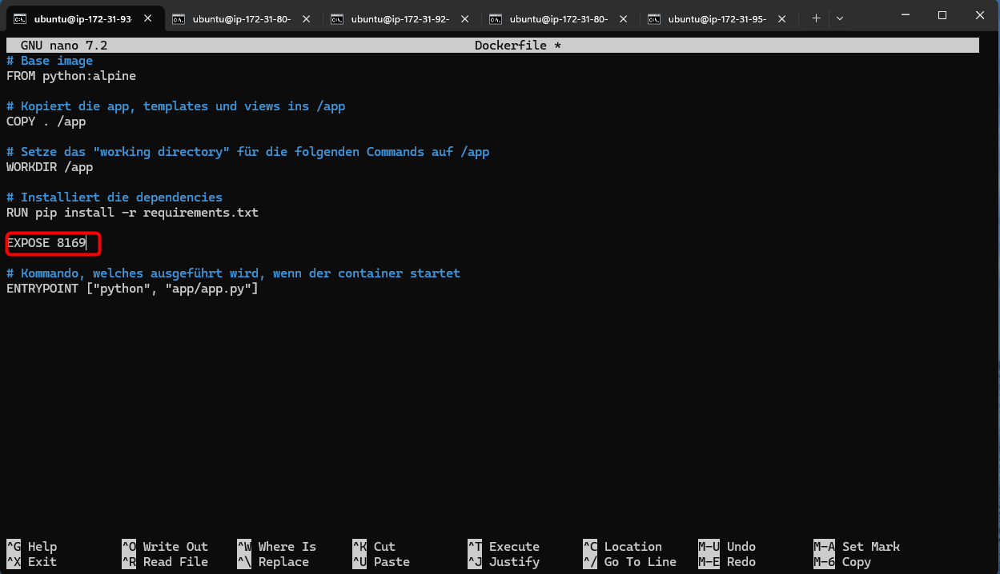
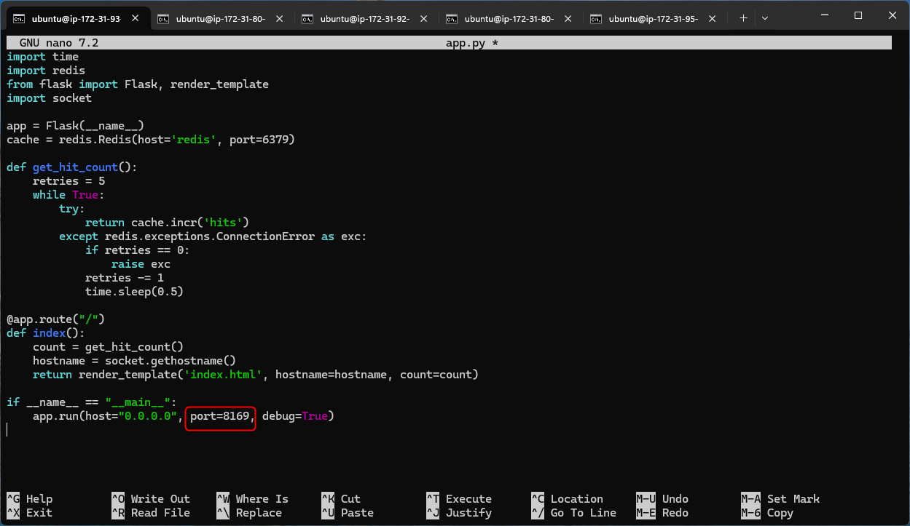
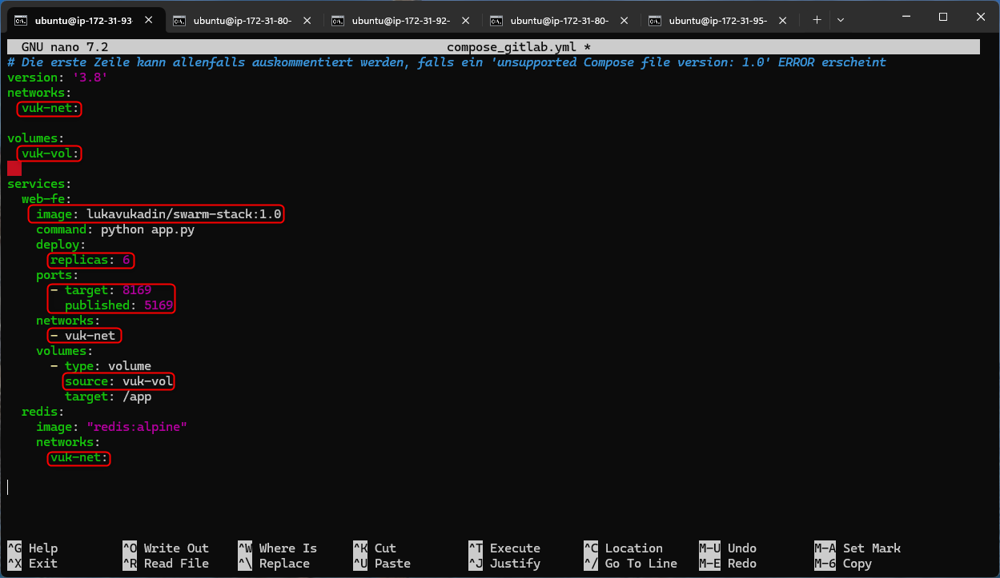

# KN04 - Containers in Action & Orchestration

## 1. Teil-Challange - Docker Image aufsetzen, in Registry ablegen und deployen - OCI: BASIC WORKFLOW

### 1. Schritt - Repository klonen

Zuerst habe ich das GitLab-Repository container-bootstrap geklont und bin in das Unterverzeichnis 01_container gewechselt:


### 2. Schritt - CSS-Hintergrundfarbe auf Goldgelb ändern

In der Datei static/css/main.css habe ich den Hintergrundfarbwert des Web-App-Textblocks auf Goldgelb #ebd63d angepasst:


### 3. Schritt - Port in app.js auf 8091 ändern

Ich habe den Port in der Datei app.js von Standard-Port 3000 auf den geforderten Port 8091 gesetzt:


### 4. Schritt - Bild „Modul 169“ einfügen

Ich habe die bestehende image.png durch das neue Bild image-new.png ersetzt (mit Titel: Modul 169):


### 5. Schritt - Port im Dockerfile freigeben

Am Ende des Dockerfiles habe ich den Port 8091 explizit mit EXPOSE freigegeben, damit er vom Container verwendet werden kann:


### 6. Schritt - Login in die GitLab Container Registry

Ich habe mich erfolgreich über die Kommandozeile bei registry.gitlab.com eingeloggt, um später Images zu pushen:


### 7. Schritt - Docker-Image lokal bauen

Ich habe das Docker-Image lokal mit folgendem Namen und Tag erstellt:

`registry.gitlab.com/luka_vukadin/container-bootstrap/webapp_luka_vukadin_8091:1.0`


### 8. Schritt - Image in die GitLab Registry pushen

Nach erfolgreichem Build habe ich das Image in die GitLab Container Registry hochgeladen:


### 9. Schritt - Container von Registry starten

Ich habe den Container mit dem gepushten Image gestartet und den Port 8091 freigegeben:


### 10. Schritt - EC2-Sicherheitsgruppe anpassen

In der AWS-Konsole habe ich in der EC2-Sicherheitsgruppe eine neue Inbound-Regel für Port 8091 (TCP) hinzugefügt, damit die App im Browser erreichbar ist:


### 11. Schritt - Container-Status prüfen

Ich habe mittels `docker ps` geprüft, ob der Container erfolgreich läuft:


### 12. Schritt - WebApp im Browser testen

Ich konnte die WebApp erfolgreich über folgenden Link im Browser erreichen: http://3.93.145.92:8091


### 13. Schritt - Container stoppen und löschen

Nach dem Test habe ich den laufenden Container gestoppt und gelöscht:


### 14. Schritt - Image lokal löschen

Abschliessend habe ich das Docker-Image lokal von der EC2-Instanz entfernt:


### Fazit

Ich konnte erfolgreich:

- Eine WebApp in einem Docker-Image anpassen,
- dieses Image in GitLab speichern,
- einen Container daraus starten
- und die App über das Internet zugänglich machen.

---

## 2. Teil-Challange - Docker Compose - Container Orchestrierung mit mehreren Services - CONTAINER MANAGEMENT: ENTRY-LEVEL

### 1. Schritt – docker-compose.yml anpassen

In der Datei docker-compose.yml habe ich folgende Änderungen vorgenommen:

- Der published Port wurde auf 5169 gesetzt.
- Der interne Port (target) wurde auf 8080 gesetzt.
- Das Volume habe ich vuk-vol genannt (nach den ersten drei Buchstaben meines Nachnamens).
- Das Netzwerk wurde vuk-net genannt.


### 2. Schritt – Split-Bild hochladen

Ich habe ein Bild von Split lokal auf meinem PC gespeichert und dann mit scp auf meine Instanz ins Verzeichnis /static/images/ übertragen. Das Bild habe ich in logo.png umbenannt.


### 3. Schritt – HTML anpassen

In der Datei index.html habe ich das FCZ-Logo durch mein eigenes Bild von Split ersetzt. AuSSerdem habe ich den Text unter dem Bild wie folgt angepasst:

„Klicke auf refresh, um der schönsten Stadt der Welt ihre verdienten Credits zu geben.
Du hast Split bisher … Credits gegeben.“


### 4. Schritt – Docker Compose starten

Danach habe ich die Anwendung mit docker compose up --build -d gestartet. Dabei wurden beide Container (Web-Frontend und Redis) gebaut und erfolgreich gestartet.


### 5. Schritt – Containerstatus überprüfen

Mit docker ps habe ich überprüft, ob beide Container laufen – und das war der Fall. Alles war „Up“.


### 6. Schritt – Sicherheitsgruppe in AWS anpassen

Damit ich von aussen auf die App zugreifen kann, habe ich in der EC2-Sicherheitsgruppe eine neue Regel hinzugefügt. Port 5169 (TCP) wurde für alle IPs (0.0.0.0/0) freigegeben.


### 7. Schritt – Web-App aufrufen

Ich konnte nun meine App erfolgreich über die URL `http://3.93.145.92:5169` erreichen. Dort wurde mein neues Split-Logo angezeigt und auch der aktualisierte Text war sichtbar. Der Refresh-Zähler funktioniert ebenfalls korrekt.


### 8. Schritt – Volume und Netzwerk inspizieren

Zur Kontrolle habe ich folgende Befehle verwendet:

````
docker volume inspect 02_compose_vuk-vol
docker network inspect 02_compose_vuk-net
````
Damit konnte ich sehen, wo genau das Volume auf dem Host gespeichert wird, und welche IP-Adressen die beiden Container im internen Docker-Netzwerk erhalten haben.


----

## 3. Teil-Challange - Docker Compose - Container Orchestrierung mit mehreren Services - CONTAINER MANAGEMENT: ENTRY-LEVEL

### 1. Schritt – EC2-Instanzen vorbereiten

Ich habe fünf EC2-Instanzen in der AWS Management Console erstellt:

- 3 für Manager-Nodes
- 2 für Worker-Nodes

Die Instanzen sind in verschiedenen Availability Zones verteilt, um Ausfallsicherheit zu gewährleisten.

Ich habe allen Instanzen dieselbe Security Group zugewiesen.


### 2. Schritt – Cloud-Init Script eingebunden

Beim Erstellen der Instanzen habe ich das folgende Cloud-Init Script eingebunden.  Dieses wird beim Start der Instanz automatisch ausgeführt und richtet die Umgebung automatisch so ein, wie ich sie für mein Docker Swarm Cluster brauche.

````
#cloud-config
packages:
  - apt-transport-https
  - ca-certificates
  - curl
  - gnupg-agent
  - software-properties-common
write_files:
  - path: /etc/sysctl.d/enabled_ipv4_forwarding.conf
    content: |
      net.ipv4.conf.all.forwarding=1
groups:
  - docker
system_info:
  default_user:
    groups: [docker]
runcmd:
  - curl -fsSL https://download.docker.com/linux/ubuntu/gpg | apt-key add -
  - add-apt-repository "deb [arch=amd64] https://download.docker.com/linux/ubuntu $(lsb_release -cs) stable"
  - apt-get update -y
  - apt-get install -y docker-ce docker-ce-cli containerd.io
  - systemctl start docker
  - systemctl enable docker
  - apt-get install podman -y
  - systemctl start podman
  - systemctl enable podman
````

**Was macht das Script konkret?**

- Es installiert wichtige Tools wie curl, gnupg-agent, software-properties-common – also alles, was man für die Paketverwaltung braucht.
- Dann wird der IPv4-Forwarding-Modus aktiviert, was nötig ist, damit die Instanzen später im Cluster korrekt miteinander kommunizieren können.
- Die Docker-Gruppe wird angelegt und der Standardnutzer (ubuntu) wird direkt dieser Gruppe hinzugefügt – so kann ich Docker-Befehle ohne sudo ausführen.
- Danach wird Docker in einer stabilen Version installiert, inklusive Container Runtime containerd.io.
- Zusätzlich wird auch noch Podman installiert – das ist ein alternatives Container-Tool, welches Docker-kompatibel ist.
- Zum Schluss werden beide Dienste (docker, podman) automatisch gestartet und so konfiguriert, dass sie bei jedem Neustart automatisch wieder laufen.


### 3. Schritt – Docker Swarm initialisieren (Manager 1)

Ich habe mich via SSH auf den ersten Manager-Node verbunden und mit folgendem Befehl den Swarm initialisiert:

````
docker swarm init --advertise-addr <PRIVATE_IP_MANAGER_1>
````


### 4. Schritt – Manager & Worker Nodes joinen

Anschliessend habe ich die anderen Nodes (Manager 2, Manager 3, Worker 1 und Worker 2) mit den jeweiligen Join-Tokens hinzugefügt:

````
# Auf Manager 2 und 3
docker swarm join --token <MANAGER_TOKEN> <PRIVATE_IP_MANAGER_1>:2377
````

- Manager2


- Manager3 


````
# Auf Worker 1 und 2
docker swarm join --token <WORKER_TOKEN> <PRIVATE_IP_MANAGER_1>:2377
````

- Worker1


- Worker2


### 5. Schritt – Manager-Nodes auf Drain setzen

Damit nur die Worker-Nodes Container zugewiesen bekommen, habe ich die Availability der Manager-Nodes auf Drain gesetzt. Das verhindert, dass sie produktive Container übernehmen – ein Best Practice in produktiven Umgebungen.


````
docker node update --availability drain ip-172-31-93-217
docker node update --availability drain ip-172-31-80-191
docker node update --availability drain ip-172-31-92-183
````


### 6. Schritt – Node-Status überprüfen

Auf dem ersten Manager habe ich den Cluster-Status überprüft:

````
docker node ls
````

Ergebnis:

- 3 Manager-Nodes (Leader + 2 Reachable)
- 2 Worker-Nodes (Status: Active)

Keine Nodes im Status Down oder Unreachable


---

## 4. Teil-Challange - Service Deployment & Skalierung mit Docker Swarm

### 1. Schritt – Service bereitstellen

Bevor ich den Service erstellt habe habe ich mit docker node ls`` überprüft ob die manager und worker richtig komnfiguriert wurden von mir und dies war der fall Grün sind die Manager und Blau die Worker:


Jetzt kann ich den Befehl ausführen

**Befehl:**
````
docker service create --name 169-web --replicas 5 -p 5010:8080 marcellocalisto/webapp_one:1.0
````

**Erklärung:**

Dieser Befehl erstellt einen neuen Swarm-Service namens 169-web der:

- extern auf Port 5010 lauscht (für den Browser)
- intern auf Port 8080 im Container läuft
- 5 Replikas des Containers startet


Zum zeigen das der Befehl nur auf einer Manager Instance läuft, habe ich getestet ob es bei einem worker funktioniert und dies war nicht fer fall es kommt die meldung `this is not a swarm manager`:


### Schritt 2 – Service mit docker service ps prüfen

**Befehl:**

````
docker service ps 169-web
````

**Erklärung:**

Dieser Befehl zeigt die Task-Liste des Services:

- Welche Container wo laufen
- Ob sie „Running“, „Failed“ oder „Shutdown“ sind
- Die IDs der Container


### Schritt 3 – AWS Security Group: Port 5010 öffnen

**Ort:**
AWS EC2 Console → Instanzen → Sicherheitsgruppen → docker-swarm-cluster

**Aktion:**
Folgende Inbound-Regel wurde hinzugefügt:

| Typ              | Protokoll | Portbereich | Quelle    | Beschreibung                  |
| ---------------- | --------- | ----------- | --------- | ----------------------------- |
| Benutzerdef. TCP | TCP       | 5010        | 0.0.0.0/0 | Web-App öffentlich zugänglich |


**Erklärung:**
Damit ich meine Web-App öffentlich über http://<Public-IP>:5010 aufrufen kann, muss ich den Port 5010 in der Security Group explizit öffnen können – auf allen relevanten Instanzen (Manager + Worker). Ohne diese Regel bleibt der Port blockiert.


### Schritt 4 – Web-App über den Browser aufrufen

**URL im Browser:**

````
http://<Public-IP>:5010`
````

**Erklärung:**

Wenn ich die IP-Adresse eines Worker-Nodes verwende (z. B. 18.233.156.9:5010), wird die Anfrage an einen Container im Swarm weitergeleitet.
Beim Neuladen der Seite sieht man unterschiedliche Container-IDs – das zeigt, dass ein Load Balancer aktiv ist.

1. Website ohne Reload


2. Website mit Reload


### Schritt 5 – Service auf 10 Container skalieren

**Befehl:**
````
docker service scale 169-web=10
````

**Erklärung:**

Mit diesem Befehl wird der bestehende Service auf 10 Container erweitert. Docker Swarm verteilt sie automatisch auf die verfügbaren Worker-Nodes.


### Schritt 6 – Verteilung prüfen

**Befehle:**

````
# Auf dem Manager-Node
docker service ps 169-web
````

````
# Auf beiden Worker-Nodes
docker container ls
````

**Erklärung:**

Nach dem Skalieren des Services auf 10 Container zeigt docker service ps, dass die Tasks gleichmässig auf die beiden Worker-Nodes verteilt wurden.
Mit docker container ls auf jedem Worker sehen wir, dass auf jedem Node 5 Container laufen.


Zeigt alle 10 Container (Tasks) des Services 169-web und auf welchen Nodes sie laufen.

- 5 laufen auf ip-172-31-80-40
- 5 laufen auf ip-172-31-95-73


Zeigt die lokal laufenden Container auf Worker 1 – genau 5 Stück.


Zeigt die lokal laufenden Container auf Worker 2 – ebenfalls 5 Stück.


### Schritt 7 – 3 Container manuell löschen

**Auf einem Worker-Node:**
````
docker container rm -f <ID1> <ID2> <ID3>`
````

**Erklärung:**

Ich habe drei Container gelöscht und sie wurden im Manager als Failed angezeigt:


### Schritt 8 – Service löschen und aufräumen

**Befehl:**
````
docker service rm 169-web
````


**Dann prüfen mit:**

in manager
````
docker service ls
````


in Worker
````
docker container ls
````


**Erklärung:**

Der komplette Service wird entfernt, inkl. aller laufenden Container. Danach sind keine aktiven Services oder Container mehr sichtbar.


- docker service rm erfolgreich
- docker service ls → leer
- docker container ls auf beiden Workern → leer


----

## 5. Teil-Challange - Service Deployment & Skalierung mit Docker Swarm











### Schritt 1 – 


### Schritt 2 – 


### Schritt 3 – 


### Schritt 4 – 


### Schritt 5 – 


### Schritt 6 – 


### Schritt 7 – 
