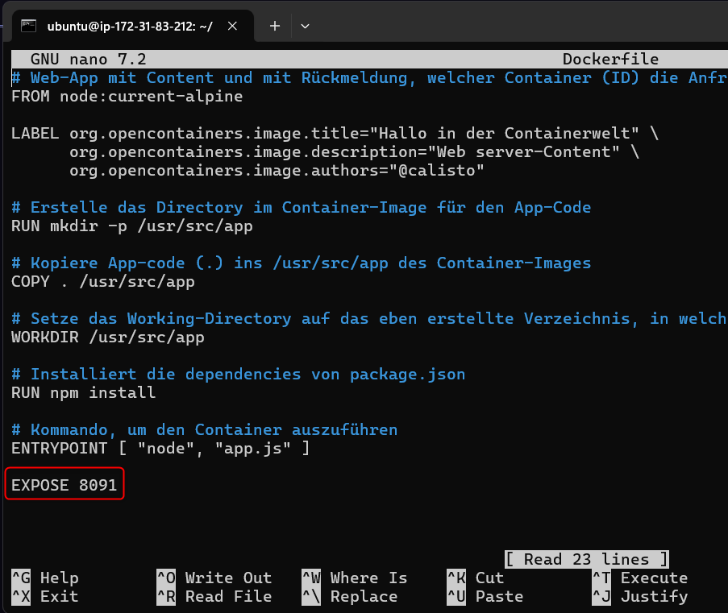

# KN04 - Containers in Action & Orchestration

## 1. Teil-Challange

### 1. Schritt - Repository klonen

Zuerst habe ich das GitLab-Repository container-bootstrap geklont und bin in das Unterverzeichnis 01_container gewechselt:

### 2. Schritt - CSS-Hintergrundfarbe auf Goldgelb ändern

In der Datei static/css/main.css habe ich den Hintergrundfarbwert des Web-App-Textblocks auf Goldgelb #ebd63d angepasst:

### 3. Schritt - Port in app.js auf 8091 ändern

Ich habe den Port in der Datei app.js von Standard-Port 3000 auf den geforderten Port 8091 gesetzt:

### 4. Schritt - Bild „Modul 169“ einfügen

Ich habe die bestehende image.png durch das neue Bild image-new.png ersetzt (mit Titel: Modul 169):

### 5. Schritt - Port im Dockerfile freigeben

Am Ende des Dockerfiles habe ich den Port 8091 explizit mit EXPOSE freigegeben, damit er vom Container verwendet werden kann:

### 6. Schritt - Login in die GitLab Container Registry

Ich habe mich erfolgreich über die Kommandozeile bei registry.gitlab.com eingeloggt, um später Images zu pushen:

### 7. Schritt - Docker-Image lokal bauen

Ich habe das Docker-Image lokal mit folgendem Namen und Tag erstellt:

`registry.gitlab.com/luka_vukadin/container-bootstrap/webapp_luka_vukadin_8091:1.0`

### 8. Schritt - Image in die GitLab Registry pushen

Nach erfolgreichem Build habe ich das Image in die GitLab Container Registry hochgeladen:

### 9. Schritt - Container von Registry starten

Ich habe den Container mit dem gepushten Image gestartet und den Port 8091 freigegeben:

### 10. Schritt - EC2-Sicherheitsgruppe anpassen

In der AWS-Konsole habe ich in der EC2-Sicherheitsgruppe eine neue Inbound-Regel für Port 8091 (TCP) hinzugefügt, damit die App im Browser erreichbar ist:

### 11. Schritt - Container-Status prüfen

Ich habe mittels `docker ps` geprüft, ob der Container erfolgreich läuft:

### 12. Schritt - WebApp im Browser testen

Ich konnte die WebApp erfolgreich über folgenden Link im Browser erreichen: http://3.93.145.92:8091

### 13. Schritt - Container stoppen und löschen

Nach dem Test habe ich den laufenden Container gestoppt und gelöscht:

### 14. Schritt - Image lokal löschen

Abschliessend habe ich das Docker-Image lokal von der EC2-Instanz entfernt:

### Fazit

Ich konnte erfolgreich:

- Eine WebApp in einem Docker-Image anpassen,
- dieses Image in GitLab speichern,
- einen Container daraus starten
- und die App über das Internet zugänglich machen.

---

