# Kanban Board App

## Ziel

- Eine webbasierte Kanban-App mit folgenden Grundfunktionen:
- Boards mit mehreren Spalten: z. B. To Do, In Progress, Done
- Tasks/Karten in den Spalten (mit Titel + Beschreibung)
- Tasks erstellen, löschen, verschieben

---

## Technologien

| Schicht       | Technologie                                                              |
| ------------- | ------------------------------------------------------------------------ |
| **Frontend**  | React (alternativ HTML + Bootstrap)                                      |
| **Backend**   | Node.js + Express                                                        |
| **Datenbank** | MongoDB (NoSQL, flexibel für Tasks)                                      |
| **Container** | Docker + Docker Compose                                                  |
| **Extras**    | Logging mit Winston (optional), Drag & Drop (React DnD), Auth (optional) |

---

## Projektstruktur (nach Sprints)

### Sprint 1: Basisfunktionen (Backend + Datenbank + API)

**Ziele:**

- Express-App aufbauen
- MongoDB anbinden
- REST-API-Endpunkte:
    - `GET /boards` – Alle Boards anzeigen
    - `POST /boards` – Neues Board erstellen
    - `POST /boards/:id/tasks` – Task zum Board hinzufügen
    - `PUT /tasks/:id/move` – Task in andere Spalte verschieben
    - `DELETE /tasks/:id` – Task löschen
- Dockerfile + `docker-compose.yml` für Backend + DB


### Sprint 2: Frontend + Optimierung

**Ziele:**
:
    - Board-Übers
- React-App miticht
    - Drag & Drop mit react-beautiful-dnd oder react-dnd
- API-Anbindung (Axios)
- Verbesserung:
    - Logging
    - Fehlerbehandlung
    - Optional: Benutzerverwaltung (auth-light)
- Präsentationsvorbereitung (README, Slides)

---

## Container-Struktur (docker-compose.yml)

````
services:
  backend:
    build: ./backend
    ports:
      - "5000:5000"
    depends_on:
      - mongo
    environment:
      - MONGO_URL=mongodb://mongo:27017/kanban

  frontend:
    build: ./frontend
    ports:
      - "3000:3000"
    depends_on:
      - backend

  mongo:
    image: mongo:6
    volumes:
      - mongo_data:/data/db

volumes:
  mongo_data:

````
---

## Sprint 1 – Projektstruktur anlegen & Express-Backend starten (lokal)


### 1.1 Projektstruktur anlegen

Ich habe das Projektverzeichnis über PowerShell erstellt. Der Hauptordner heisst `kanban-board`, darin befindet sich der Unterordner `backend`, der den Quellcode für das Node.js-Backend enthält.


---

## 1.2 Node.js-Projekt initialisieren

Im Ordner `backend` habe ich das Node.js-Projekt mit folgendem Befehl initialisiert:

```
npm init -y
```

Dabei wurde die Datei `package.json` automatisch erstellt. Sie enthält die grundlegenden Informationen über das Projekt und seine Abhängigkeiten.


---

## 1.3 Benötigte Pakete installieren

Mit dem folgenden Befehl habe ich alle benötigten Node.js-Pakete für das Backend installiert:

```
npm install express mongoose cors dotenv
```

Diese Bibliotheken werden für die folgenden Aufgaben genutzt:
- `express`: Webserver-Framework
- `mongoose`: Verbindung zur MongoDB-Datenbank
- `cors`: Freigabe von Cross-Origin-Requests (für das Frontend)
- `dotenv`: Laden von Umgebungsvariablen aus `.env`


---

## 1.4 Backend-Server (`server.js`) erstellen

Ich habe die Datei `server.js` im Ordner `backend` erstellt. Diese Datei enthält den Grundaufbau meines Express-Webservers. Er stellt eine Test-Route zur Verfügung und versucht beim Start eine Verbindung zur MongoDB herzustellen.

### Inhalt von `server.js`:
```javascript
const express = require('express');
const mongoose = require('mongoose');
const cors = require('cors');
require('dotenv').config();

const app = express();
app.use(cors());
app.use(express.json());

// MongoDB verbinden
mongoose.connect(process.env.MONGO_URL || 'mongodb://localhost:27017/kanban')
  .then(() => console.log('MongoDB verbunden'))
  .catch(err => console.error('MongoDB Fehler:', err));

// Test-Route
app.get('/', (req, res) => {
  res.send('Kanban Backend läuft');
});

const PORT = process.env.PORT || 5000;
app.listen(PORT, () => {
  console.log(`Server läuft auf Port ${PORT}`);
});
```


---

## 1.5 Umgebungsvariablen (`.env`) anlegen

Ich habe im Ordner `backend` eine Datei mit dem Namen `.env` erstellt. Sie enthält die Verbindungsinformationen zur MongoDB:

```
MONGO_URL=mongodb://localhost:27017/kanban
```

Der Server lädt diese Variable automatisch beim Start und verwendet sie für den Datenbankzugriff.


## 1.6 Dockerfile für das Backend erstellen


Ich habe im Ordner backend/ ein Dockerfile erstellt, das den Container für das Node.js-Backend definiert. Es basiert auf dem offiziellen Node.js-Image, kopiert alle Projektdateien, installiert Abhängigkeiten und startet den Server.


## 1.7 docker-compose.yml erstellen

Im Hauptverzeichnis des Projekts habe ich eine docker-compose.yml Datei erstellt. Diese definiert zwei Services:

- backend: Node.js-Anwendung, wird aus dem lokalen Dockerfile gebaut
- mongo: Offizieller MongoDB-Container mit Volume zur Datenspeicherung
Das Compose-Setup ermöglicht eine vollständig containerisierte Umgebung für Entwicklung und Test.


## 1.8 Container starten und testen

Ich habe im Hauptverzeichnis des Projekts den Befehl ausgeführt:

`````
docker-compose up --build
`````


Dabei wurden zwei Container gestartet:

- backend: aus meinem eigenen Dockerfile gebaut
- mongo: offizielle MongoDB aus Docker Hub

Nach dem Start wurde die Verbindung zur MongoDB in der Konsole mit „MongoDB verbunden“ bestätigt.
Anschliessend konnte ich die Anwendung über den Browser unter http://localhost:5000 aufrufen und erhielt erfolgreich die Nachricht:

```
Kanban Backend läuft
```


---

## Sprint 2 – Mongoose Task-Modell erstellen

### 2.1 Datenmodell (Task.js) erstellen

Im Backend habe ich im Verzeichnis models/ eine Datei Task.js erstellt. Dort wird mithilfe von Mongoose ein Schema definiert, das die Struktur eines Tasks beschreibt:

- `title`: Titel der Aufgabe (Pflichtfeld)
- `description`: Beschreibung (optional)
- `status`: aktuelle Spalte im Kanban-Board (todo, inprogress, done)
- `createdAt`: Erstellungsdatum

Dieses Schema wird zur Erstellung, Speicherung und Abfrage der Aufgaben in der MongoDB verwendet.


### 2.2 REST API für Task-Management erstellen

Ich habe im Verzeichnis `routes/` die Datei `tasks.js` erstellt. Sie enthält die CRUD-Endpunkte zur Verwaltung der Kanban-Aufgaben:

- `GET /api/tasks`: Alle Tasks abrufen
- `POST /api/tasks`: Neuen Task erstellen
- `DELETE /api/tasks/:id`: Task löschen
- `PUT /api/tasks/:id/move`: Task in eine andere Spalte verschieben

Die API verwendet das vorher definierte Mongoose-Modell `Task`. In der Datei `server.js` habe ich die Routen mit folgendem Befehl eingebunden:

```js
const taskRoutes = require('./routes/tasks');
app.use('/api/tasks', taskRoutes);
```


Nach der Erweiterung des Backends um das Datenmodell und die API-Routen habe ich die laufende Docker-Umgebung mit Strg + C gestoppt und anschliessend mit docker-compose up --build neu gestartet. Damit wurde das Backend neu gebaut und die Änderungen aktiv.

#### Fehler beim Start

Beim ersten Versuch trat folgender Fehler auf:

```
Error: Cannot find module '../models/Task'
Require stack:
- /app/routes/tasks.js
- /app/server.js
```

---

#### Analyse & Ursache

Die Datei `task.js` war zwar vorhanden, aber:

- Import in `tasks.js` war: `require('../models/Task')`
- Tatsächlicher Dateiname: `task.js` (klein)


---

#### Lösung

Der Import wurde angepasst:

```diff
- const Task = require('../models/Task');
+ const Task = require('../models/task');
```

Anschliessend wurde der Container neu gestartet und es hat funktioniert:

```bash
docker-compose up --build
```


---

### 2.2: Task-Endpunkte testen mit Thunder Client

####  Ziel
Die in Sprint 2.1 implementierten API-Endpunkte sollen mit **Thunder Client** getestet werden, um sicherzustellen, dass sie korrekt funktionieren.

---

#### Thunder Client installieren

Thunder Client ist ein REST-Client, der direkt als Erweiterung in **Visual Studio Code** genutzt werden kann.

**Installation:**
- VS Code öffnen
- In der Seitenleiste auf "Extensions" (Erweiterungen) klicken
- Nach `Thunder Client` suchen und installieren


---

#### GET – Alle Tasks abrufen

**Anfrage:**
GET http://localhost:5000/api/tasks

Ergebnis:
- Die Anfrage wird mit `Status 200 OK` beantwortet
- Wenn noch keine Tasks vorhanden sind, ist das Ergebnis: `[]`


---

#### POST – Neuen Task erstellen

**Anfrage:**
POST http://localhost:5000/api/tasks

````
**Body (JSON):**
```json
{
  "title": "Thunder Client testen",
  "description": "Testen der REST-API mit Thunder Client.",
  "status": "todo"
}
````

Ergebnis: Task wurde erfolgreich erstellt und in der Datenbank gespeichert. Die Antwort enthält die erzeugte Task-ID.


#### PUT – Task bearbeiten (Fehler)

Fehlerhafte Anfrage:

````
PUT http://localhost:5000/api/tasks/<id>
````

**Antwort:**

````
404 Not Found
Cannot PUT /api/tasks/<id>
````


**Ursache:**
Die Route war ursprünglich falsch definiert:

router.put('/:id/move', ...)


#### Fehlerbehebung

Die Route wurde im Code geändert zu:

````
router.put('/:id', async (req, res) => {
  try {
    const updatedTask = await Task.findByIdAndUpdate(
      req.params.id,
      {
        status: req.body.status
      },
      { new: true }
    );
    res.json(updatedTask);
  } catch (err) {
    res.status(400).json({ message: err.message });
  }
});
````


#### PUT – Task bearbeiten funktioniert

**Anfrage:**

````
PUT http://localhost:5000/api/tasks/<gültige-ID>
````

**Body:**

````
{
  "title": "Thunder Client testen",
  "description": "Testen der REST-API mit Thunder Client.",
  "status": "todo"
}
````

Ergebnis: Task wird erfolgreich aktualisiert.


#### DELETE-Request testen

Ich möchte einen bestehenden Task aus der MongoDB-Datenbank löschen – mithilfe eines **DELETE-Requests** im Thunder Client Plugin von Visual Studio Code.

Als erstes habe ich im Thunder Client einen **GET-Request** durchgeführt, um alle Tasks zu sehen:
   ```
   GET http://localhost:5000/api/tasks
   ```
3. Aus der Antwort habe ich mir die `_id ` eines vorhandenen Tasks gemerkt.


---

**Anfrage:**

   ```
   DELETE http://localhost:5000/api/tasks
   ```

   Ergebnis: Task wurde gelöscht.

```json
{
  "message": "Task gelöscht"
}
```


**Prüfen**

Danach habe ich zur Kontrolle nochmals einen GET-Request abgesetzt – und der gelöschte Task war nicht mehr vorhanden.


---

## Sprint 3 – Frontend starten

### 3.1 Frontend-Projekt mit Vite & React erstellen

Für das Frontend meines Kanban-Projekts habe ich ein neues Projekt mit Vite erstellt. Ich verwende React als Framework, um die Benutzeroberfläche dynamisch und modern zu gestalten.


#### 1. Schritt - Projekt erstellen

Ich habe im Hauptordner des Projekts folgenden Befehl ausgeführt:

````
npm create vite@latest frontend -- --template react
````

Damit wurde im Ordner frontend/ ein neues React-Projekt erzeugt.


#### 2. Schritt - Abhängigkeiten installieren

Danach bin ich in den frontend/-Ordner gewechselt und habe alle benötigten Pakete installiert:

````
cd frontend
npm install
````


#### 3. Schritt - Projekt starten

Mit folgendem Befehl habe ich das React-Projekt gestartet:

````
npm run dev
````


Danach war das Projekt unter http://localhost:5173 im Browser erreichbar.
Ich habe die Startseite von Vite + React gesehen.


Das Frontend läuft erfolgreich im Entwicklungsmodus. Ich bin jetzt bereit, mit der Umsetzung der Benutzeroberfläche für das Kanban-Board zu starten.

---

### 3.2 - Projektstruktur aufräumen und vorbereiten

#### 1. Schritt: Unnötige Dateien löschen

Nachdem ich das Vite + React Projekt erfolgreich erstellt und im Browser getestet habe, wollte ich die Projektstruktur etwas aufräumen. Ich habe deshalb unnötige Dateien und Ordner gelöscht, die ich im späteren Verlauf nicht brauche.

- ssets/
- App.css
- vite.svg

Ich wollte ein sauberes Setup haben, um mit meiner eigenen Struktur zu starten.


#### 2. Schritt: App.jsx anpassen

Danach habe ich die Datei `App.jsx` überarbeitet und folgenden Code eingefügt, um mein Projekt zu starten:

````
function App() {
  return (
    <div>
      <h1>Kanban Board</h1>
      <p>Willkommen im Frontend meines Kanban-Projekts!</p>
    </div>
  );
}

export default App;

````


Anschliessend habe ich wie gewohnt den Befehl ausgeführt:

````
npm run dev
````
Doch plötzlich kam eine Fehlermeldung in der Konsole sowie im Browser:

#### 3. Schritt: Fehler beim Start

Fehlermeldung:

````
[vite] Internal server error: Failed to resolve import "./index.css" from "src/main.jsx". Does the file exist?
````


#### 4. Schritt: Fehler beheben

Ich habe das Problem gelöst, indem ich im src-Ordner eine neue Datei index.css erstellt habe mit folgendem Inhalt:

```
body {
  margin: 0;
}
```
Nach dem Speichern und erneutem Ausführen von npm run dev hat alles funktioniert.

#### 5. Schritt: Warum der Fehler aufgetreten ist:

Der Fehler kam, weil in der Datei main.jsx ein Import vorhanden war:

````
import './index.css';
````

Da ich beim Aufräumen die Datei `index.css` gelöscht hatte, konnte Vite den Import nicht auflösen und ist mit einem Fehler abgebrochen.

Mit dem Erstellen der neuen `index.css` und einem kleinen Inhalt `(body { margin: 0; })` wurde das Problem behoben – die Datei war wieder da, und Vite konnte normal starten.

#### 6. Schritt: Ergebnis

Meine Seite wurde wie gewünscht angezeigt:

Kanban Board
Willkommen im Frontend meines Kanban-Projekts!


---

### 3.3 - Verbindung zum Backend testen (API-Aufruf aus React)

#### Ziel:

Ich möchte, dass mein React-Frontend die Daten vom Backend anzeigt – also Tasks, die ich über Thunder Client oder direkt in der Datenbank gespeichert habe.

#### 1. Schritt - Umsetzung:

Ich habe die Datei App.jsx bearbeitet und folgenden Code eingefügt:

````
import { useEffect, useState } from "react";

function App() {
  const [tasks, setTasks] = useState([]);

  useEffect(() => {
    fetch("http://localhost:5000/api/tasks")
      .then((res) => res.json())
      .then((data) => setTasks(data))
      .catch((err) => console.error("Fehler beim Laden der Tasks:", err));
  }, []);

  return (
    <div>
      <h1>Kanban Board</h1>
      <p>Willkommen im Frontend meines Kanban-Projekts!</p>

      <h2>Tasks:</h2>
      <ul>
        {tasks.map((task) => (
          <li key={task._id}>
            <strong>{task.title}</strong>: {task.description} [{task.status}]
          </li>
        ))}
      </ul>
    </div>
  );
}

export default App;
````


#### 2. Schritt - Erklärung, was passiert:

| Funktion             | Bedeutung                                                         |
| -------------------- | ----------------------------------------------------------------- |
| `useEffect(...)`     | Wird beim Start der Seite ausgeführt (API wird einmal aufgerufen) |
| `fetch("...")`       | Holt die Task-Daten vom Backend (GET-Request)                     |
| `setTasks(data)`     | Speichert die empfangenen Daten im State `tasks`                  |
| `map(...)` in `<ul>` | Zeigt alle Tasks als Liste im Frontend an                         |


#### Ergebnis:

- Ich sehe im Browser jetzt meine gespeicherten Tasks aus der MongoDB.
- Es funktioniert, solange Backend + Datenbank korrekt laufen.


---

### 3.4 – Layout strukturieren und Komponenten erstellen

#### Was ich gemacht habe:

In diesem Schritt habe ich meinen bisherigen Code in App.jsx aufgeräumt und sinnvoll ausgelagert.
Ich habe eine neue Komponente erstellt:

- `TaskList.jsx` – Diese Komponente zeigt eine Liste aller Tasks an.

Ursprünglich war auch eine `TaskItem.jsx` geplant, aber ich habe mich entschieden, die Darstellung jedes einzelnen Tasks direkt in `TaskList.jsx` zu integrieren. Das war für meine aktuelle Projektgröße einfacher und übersichtlicher.

#### 1. Schritt - Neue Datei TaskList.jsx erstellt
Im Ordner src/ habe ich eine neue Datei TaskList.jsx angelegt.


#### 2. Schritt - Code für TaskList.jsx geschrieben

In dieser Komponente hole ich die Tasks per fetch() aus dem Backend und gebe sie direkt mit einer map()-Funktion als <li>-Elemente aus.

````
// src/TaskList.jsx
import { useEffect, useState } from "react";

function TaskList() {
  const [tasks, setTasks] = useState([]);

  useEffect(() => {
    fetch("http://localhost:5000/api/tasks")
      .then((res) => res.json())
      .then((data) => setTasks(data));
  }, []);

  return (
    <div>
      <h2>Tasks:</h2>
      <ul>
        {tasks.map((task) => (
          <li key={task._id}>
            <strong>{task.title}</strong>: {task.description} [{task.status}]
          </li>
        ))}
      </ul>
    </div>
  );
}

export default TaskList;`

````


#### 3. Schritt - App.jsx angepasst

In meiner Hauptkomponente App.jsx habe ich TaskList importiert und eingebunden:

````
import TaskList from "./TaskList";

function App() {
  return (
    <div>
      <h1>Kanban Board</h1>
      <p>Willkommen im Frontend meines Kanban-Projekts!</p>
      <TaskList />
    </div>
  );
}

export default App;

````


#### Warum habe ich das gemacht?

Ich habe den Code in eine eigene Komponente ausgelagert, damit:

- mein Code übersichtlicher wird
- ich leichter neue Funktionen (z. B. löschen, bearbeiten) einbauen kann
- ich bessere Wiederverwendbarkeit habe

Obwohl sich im Browser fast nichts verändert hat, ist der Code jetzt viel sauberer und strukturierter.
Das hilft mir später beim Erweitern des Projekts.

----

#### 3.5 - Task erstellen (POST) über das Frontend

#### Was ich gemacht habe:

In diesem Schritt habe ich eine neue Komponente erstellt, mit der ich direkt im Frontend neue Tasks erstellen kann. Diese werden über einen HTTP POST Request an das Backend gesendet und anschliessend in der Liste angezeigt – ohne die Seite zu aktualisieren.

#### 1. Schritt - Neue Datei TaskForm.jsx erstellt

Ich habe im Ordner src/components/ die Datei TaskForm.jsx angelegt.


#### 2. Schritt - TaskForm.jsx geschrieben

In dieser Komponente habe ich ein Formular programmiert, das title, description und status an das Backend sendet. Nach dem Absenden wird der neue Task automatisch zur Liste hinzugefügt.

````
import { useState } from "react";

function TaskForm({ setTasks }) {
  const [title, setTitle] = useState("");
  const [description, setDescription] = useState("");
  const [status, setStatus] = useState("todo");

  const handleSubmit = async (e) => {
    e.preventDefault();
    const newTask = { title, description, status };

    const res = await fetch("http://localhost:5000/api/tasks", {
      method: "POST",
      headers: {
        "Content-Type": "application/json",
      },
      body: JSON.stringify(newTask),
    });

    const savedTask = await res.json();
    setTasks((prevTasks) => [...prevTasks, savedTask]);

    // Felder leeren
    setTitle("");
    setDescription("");
    setStatus("todo");
  };

  return (
    <form onSubmit={handleSubmit}>
      <h2>Neuen Task erstellen</h2>
      <input
        type="text"
        placeholder="Titel"
        value={title}
        onChange={(e) => setTitle(e.target.value)}
      />
      <input
        type="text"
        placeholder="Beschreibung"
        value={description}
        onChange={(e) => setDescription(e.target.value)}
      />
      <select value={status} onChange={(e) => setStatus(e.target.value)}>
        <option value="todo">To Do</option>
        <option value="inprogress">In Progress</option>
        <option value="done">Done</option>
      </select>
      <button type="submit">Erstellen</button>
    </form>
  );
}

export default TaskForm;
````


#### 3. Schritt - App.jsx angepasst

Ich habe die neue Komponente importiert und direkt über die Task-Liste eingefügt. Zusätzlich habe ich setTasks als Prop übergeben, damit das Formular neue Tasks hinzufügen kann.

````
import { useEffect, useState } from "react";
import TaskForm from "./components/TaskForm";
import TaskList from "./components/TaskList";

function App() {
  const [tasks, setTasks] = useState([]);

  useEffect(() => {
    fetch("http://localhost:5000/api/tasks")
      .then((res) => res.json())
      .then((data) => setTasks(data))
      .catch((err) => console.error("Fehler beim Laden der Tasks:", err));
  }, []);

  return (
    <div>
      <h1>Kanban Board</h1>
      <p>Willkommen im Frontend meines Kanban-Projekts!</p>
      <TaskForm setTasks={setTasks} />
      <TaskList tasks={tasks} />
    </div>
  );
}

export default App;

````


#### 4. Schritt - Task im Browser erstellt

Ich habe nun einen neuen Task direkt im Frontend eingetragen – nach dem Klick auf „Erstellen“ erscheint der neue Task sofort in der Liste, ohne dass ich die Seite neu laden muss.


#### Warum hat es vorher nicht funktioniert?

Zuerst habe ich der neuen Task zwar erfolgreich an das Backend gesendet, aber die React-Komponente hat sich nicht neu gerendert, weil der tasks-State nicht aktualisiert wurde.

#### Warum funktioniert es jetzt?

Durch den Aufruf `setTasks((prevTasks) => [...prevTasks, savedTask])` wird der neue Task direkt zum aktuellen Zustand (`State`) hinzugefügt → und React zeigt die Änderung sofort im UI an.

Ich habe also verstanden:

- wie man ein Formular in React verarbeitet
- wie man per `fetch` einen Task sendet
- wie man den `State` aktualisiert, ohne neu zu laden

----

### 3.6 - Task löschen (DELETE)

#### Was ich gemacht habe:

In diesem Schritt habe ich mein Kanban-Board erweitert, sodass ich Tasks direkt aus dem Frontend löschen kann. Dafür habe ich eine neue Komponente namens TaskItem.jsx erstellt. Diese zeigt jeweils einen Task mit einem "Löschen"-Button an.

Sobald ich auf den Button klicke, wird der Task aus dem Backend gelöscht – und die Liste aktualisiert sich automatisch, ohne dass ich die Seite neu laden muss.

#### 1. Schritt - Neue Datei TaskItem.jsx erstellt

Ich habe die Datei TaskItem.jsx im components-Ordner erstellt. Diese Komponente erhält den Task sowie die setTasks-Funktion, um nach dem Löschen die Ansicht zu aktualisieren.

````
function TaskItem({ task, setTasks }) {
  const deleteTask = () => {
    fetch(`http://localhost:5000/api/tasks/${task._id}`, {
      method: "DELETE",
    })
      .then((res) => {
        if (res.ok) {
          setTasks((prevTasks) => prevTasks.filter((t) => t._id !== task._id));
        }
      })
      .catch((err) => console.error("Fehler beim Löschen:", err));
  };

  return (
    <li>
      <strong>{task.title}</strong>: {task.description} [{task.status}]
      <button onClick={deleteTask}>Löschen</button>
    </li>
  );
}

export default TaskItem;
````


#### 2. Schritt - TaskList.jsx angepasst

In TaskList.jsx habe ich den Import ergänzt und beim Rendern der Liste die neue Komponente verwendet – und setTasks mitgegeben:

````
import TaskItem from "./TaskItem";

...

{tasks.map((task) => (
  <TaskItem key={task._id} task={task} setTasks={setTasks} />
))}

````


#### 3. Schritt - App.jsx bleibt wie vorher

Da App.jsx schon setTasks an TaskList übergibt, musste ich nichts daran ändern.


#### Ergebnis

Ich konnte erfolgreich einen Task löschen und musste die Seite nicht reloaden


----

### 3.7 - Tasks im Frontend bearbeiten (PUT-Anfrage)

#### Ziel

Ich wollte ermöglichen, dass man im Frontend **bestehende Tasks bearbeiten** kann – also **Titel**, **Beschreibung** und **Status** ändern.  
Diese Änderungen sollen per `PUT`-Request an das Backend gesendet und direkt in der Datenbank gespeichert werden.

---

#### Umsetzung im Frontend

Ich habe in der Datei `TaskItem.jsx` eine Bearbeitungsfunktion eingebaut, sodass beim Klick auf „Bearbeiten“ ein Formular erscheint. Nach Änderungen kann man auf „Speichern“ klicken und der neue Task wird ans Backend gesendet.

#### Neue oder geänderte Funktion:

````
```jsx
function handleSave() {
  fetch(`http://localhost:5000/api/tasks/${task._id}`, {
    method: "PUT",
    headers: { "Content-Type": "application/json" },
    body: JSON.stringify(editedTask),
  })
    .then((res) => res.json())
    .then((updatedTask) => {
      onUpdate(updatedTask);
      setIsEditing(false);
    });
}
````


#### Warum dieser Code

- `editedTask` enthält alle bearbeiteten Felder (title, description, status)
- Der Request wird an die API geschickt
- Nach Erfolg wird die Parent-Komponente (`TaskList`) mit den neuen Daten aktualisiert


#### Problem: Änderungen an Titel & Beschreibung wurden nicht übernommen

**Beim Testen habe ich festgestellt:**

- Status wurde aktualisiert
- Titel & Beschreibung blieben gleich


**Fehlersymptom:**

- Ich änderte den Titel, klickte auf „Speichern“
- Nach dem Reload war nur der Status geändert, der Titel war wieder alt

**Fehlerursache:**

- Backend-Route /api/tasks/:id (PUT)
- Ich habe im Backend die Datei routes/tasks.js überprüft und folgendes festgestellt:

````
// Ursprünglicher Code (Fehler!)
Task.findByIdAndUpdate(
  req.params.id,
  { status: req.body.status },
  { new: true }
);
````
Hier wird nur das Feld status gespeichert – alle anderen Felder (title, description) werden ignoriert, auch wenn sie mitgeschickt wurden.


#### Lösung: Backend-Route anpassen

Ich habe den Code wie folgt geändert:

````
// Neuer Code – alle Felder werden übernommen!
Task.findByIdAndUpdate(
  req.params.id,
  {
    title: req.body.title,
    description: req.body.description,
    status: req.body.status
  },
  { new: true }
);
````


#### Ergebnis nach Fix:

- Ich kann jetzt Titel, Beschreibung und Status eines Tasks im Frontend ändern
- Nach dem Speichern wird die Taskliste automatisch aktualisiert


----

### 3.8 – Tasks nach Status sortieren (Spalten-Layout)

#### Was ich gemacht habe

Ich habe mein Frontend so erweitert, dass die Aufgaben nach Status (To Do, In Progress, Done) angezeigt werden – in drei klar getrennten Spalten wie in einem echten Kanban-Board.

#### 1. Schritt - TaskList.jsx erweitert

Ich habe in der Datei TaskList.jsx den bisherigen Code angepasst, damit die Aufgaben nicht mehr einfach untereinander angezeigt werden, sondern in drei Gruppen:

##### Neue Logik:

````
const groupedTasks = {
  todo: tasks.filter((t) => t.status === "todo"),
  inprogress: tasks.filter((t) => t.status === "inprogress"),
  done: tasks.filter((t) => t.status === "done"),
};
````

#### Layout als drei Spalten:

Ich habe den Rückgabeteil so erweitert, dass die Gruppen nebeneinander angezeigt werden – für ein echtes Board-Feeling:

````
<div className="task-board">
  {Object.entries(groupedTasks).map(([status, list]) => (
    <div key={status} className="task-column">
      <h3>{status.toUpperCase()}</h3>
      <ul>
        {list.map((task) => (
          <TaskItem
            key={task._id}
            task={task}
            onDelete={handleDeleteTask}
            onUpdate={handleUpdateTask}
          />
        ))}
      </ul>
    </div>
  ))}
</div>`
````

📸 Screenshot hier einfügen: neue Struktur im Code oder laufendes Frontend mit 3 Spalten

#### 2. Schritt - Neue CSS-Datei TaskList.css

Damit die Spalten auch im Layout funktionieren und gut aussehen, habe ich eine neue Datei TaskList.css erstellt mit folgendem Inhalt:

````
.task-board {
  display: flex;
  justify-content: space-between;
  gap: 20px;
}`

.task-column {
  flex: 1;
  background-color: #f5f5f5;
  padding: 10px;
  border-radius: 8px;
}
````

- Diese Datei sorgt dafür, dass jede Spalte Platz bekommt, einen grauen Hintergrund hat und optisch vom Rest abgetrennt ist.


### 3. Schritt - App.jsx angepasst

Ich habe in der App.jsx den Import für die neue CSS-Datei ergänzt:

```
import "./components/TaskList.css";`
```


#### 4. Schritt – Endprodukt: Kanban-Board funktioniert!

#### Was ich nun erreicht habe

Nach mehreren Schritten habe ich mein vollständiges Kanban-Board erfolgreich umgesetzt. Die Anwendung funktioniert vollständig – von Backend über API bis hin zum interaktiven Frontend mit CRUD-Funktionalitäten:

#### Features im Überblick

| Funktion                                      | Beschreibung                                                                             |
| --------------------------------------------- | ---------------------------------------------------------------------------------------- |
| **Task erstellen**                         | Über ein Formular im Frontend kann ich neue Aufgaben hinzufügen.                         |
| **Tasks werden in drei Spalten angezeigt** | Aufgaben mit Status `todo`, `inprogress` oder `done` werden automatisch sortiert.        |
| **Task bearbeiten**                        | Ich kann Titel, Beschreibung oder den Status eines Tasks ändern.                         |
| **Task löschen**                            | Tasks können einfach entfernt werden.                                                    |
| **Live-Aktualisierung**                    | Sobald ich einen Task hinzufüge oder bearbeite, wird das sofort auf der Seite angezeigt. |


### Wie es aussieht

Das Kanban-Board ist nun in drei Spalten gegliedert:

- To Do
- In Progress
- Done

Die Oberfläche ist aufgeräumt, gut strukturiert und einsatzbereit für weitere Erweiterungen wie Drag & Drop.


----

### 3.9 - Drag & Drop für Kanban-Board


#### Ziel

Tasks sollen per Drag & Drop zwischen den Statusspalten To Do, In Progress und Done verschoben werden können.

#### 1. Schritt – Paket installieren

Um moderne Drag-and-Drop-Funktionalität zu ermöglichen, wurde das Paket @hello-pangea/dnd installiert:
````
npm install @hello-pangea/dnd
````


Dieses Paket ist ein moderner Fork von react-beautiful-dnd und kompatibel mit React 19.

#### 2. Schritt – TaskList.jsx umbauen

Ich habe die TaskList.jsx-Komponente erweitert, damit Drag-and-Drop korrekt funktioniert:

**Was wurde geändert?**

- Die gesamte <div className="board"> wurde von <DragDropContext> umgeben.
- Die drei Spalten To Do, In Progress und Done wurden mit <Droppable>-Bereichen ausgestattet.
- Jeder einzelne Task ist jetzt ein <Draggable>-Element.
- Bei Drop wird der Task-Status im Backend aktualisiert und im Frontend sofort reflektiert.


**Warum?**

Weil das Drag-and-Drop-System die Positionierung und Statusänderung von Tasks nur erkennt, wenn diese als Draggables in Droppables eingebunden sind.

#### 3. Schritt – App.jsx erweitern

In App.jsx wurde nichts verändert, ausser dass sichergestellt wurde, dass setTasks an TaskList übergeben wird, um den State nach einem Drag-and-Drop-Update neu zu setzen.


#### 4. Schritt – Neue CSS-Styles

In der Datei TaskList.css wurde das Design angepasst, damit:

- Spalten farbig erscheinen (rot, gelb, grün)
- Tasks visuell klar abgetrennt sind
- Layout modern und übersichtlich wirkt

**Warum?**

Weil Drag-and-Drop besser funktioniert, wenn visuell klar ist, wo Aufgaben landen und was verschoben wird.

#### 5. Schritt – Funktioniert alles?

Nach dem Starten von Backend und Frontend konnte erfolgreich:

- Eine neue Aufgabe erstellt werden
- Ein Task durch Drag-and-Drop in eine andere Spalte verschoben werden
- Der Status im Backend korrekt gespeichert werden
- Der Task im Frontend automatisch aktualisiert angezeigt werden


----


### 3.10 - Frontend-Optimierung 


#### 1. Schritt - Design-Anpassung der Task-Darstellung

##### Ziel:

Das Layout der Task-Karten (TaskItem) soll moderner, übersichtlicher und userfreundlicher aussehen.

##### Änderungen in TaskItem.jsx:

Ich habe den Code erweitert, damit die Aufgaben optisch schön dargestellt wird – mit abgerundeten Ecken, Farben, und besseren Buttons:

````
<li className="task-card">
  {isEditing ? (
    <>
      <input name="title" value={editedTask.title} onChange={handleChange} />
      <input name="description" value={editedTask.description} onChange={handleChange} />
      <select name="status" value={editedTask.status} onChange={handleChange}>
        <option value="todo">To Do</option>
        <option value="inprogress">In Progress</option>
        <option value="done">Done</option>
      </select>
      <button className="save-btn" onClick={handleSave}>Speichern</button>
    </>
  ) : (
    <>
      <strong>{task.title}</strong>
      <p>{task.description}</p>
      <span className="status-tag">{task.status}</span>
      <div className="task-actions">
        <button className="edit-btn" onClick={() => setIsEditing(true)}>Bearbeiten</button>
        <button className="delete-btn" onClick={() => onDelete(task._id)}>Löschen</button>
      </div>
    </>
  )}
</li>`
````

📸 Vorher-Nachher Screenshot einer Task-Karte im Board

#### 2. Schritt - CSS-Styles (TaskItem.css oder global):

````
.task-card {
  background-color: white;
  border-radius: 10px;
  padding: 12px;
  box-shadow: 0 4px 6px rgba(0,0,0,0.1);
  margin-bottom: 10px;
  transition: transform 0.2s ease;
}

.task-card:hover {
  transform: scale(1.01);
}

.task-actions {
  margin-top: 10px;
  display: flex;
  gap: 8px;
}

.edit-btn {
  background-color: #1976d2;
  color: white;
  padding: 4px 10px;
  border-radius: 5px;
}

.delete-btn {
  background-color: #d32f2f;
  color: white;
  padding: 4px 10px;
  border-radius: 5px;
}
````

#### 3. Schritt - UI-Verbesserung beim Task-Erstellen

##### Ziel:

Das Formular zur Erstellung eines Tasks soll moderner und zentriert aussehen – mit besseren Eingabefeldern.

##### Änderungen in TaskForm.jsx:

````
<div className="taskform-container">
  <h2>Task erstellen</h2>
  <form className="taskform" onSubmit={handleSubmit}>
    <input type="text" name="title" placeholder="Titel" />
    <input type="text" name="description" placeholder="Beschreibung" />
    <select name="status">...</select>
    <button>Erstellen</button>
  </form>
</div>
````

##### CSS:

````
.taskform-container {
  background-color: white;
  border-radius: 12px;
  padding: 30px;
  box-shadow: 0 4px 12px rgba(0,0,0,0.1);
  max-width: 600px;
  margin: 0 auto;
  text-align: center;
}

.taskform input,
.taskform select {
  width: 90%;
  padding: 10px;
  margin-bottom: 15px;
  border-radius: 8px;
  border: 1px solid #ccc;
}
````

➡️ Screenshot hinzufügen:
📸 Neues Task-Formular nach dem Styling (zentriert, modern)


#### 4. Schritt - Entfernung von doppeltem „Task erstellen“ Header

##### Problem:

Im TaskForm.jsx gab es zweimal den Text "Task erstellen" – oben außerhalb des Formulars und im Formular selbst.

##### Lösung:

Ich habe die zweite (überflüssige) Überschrift gelöscht:

````
// entfernt: <h2>Task erstellen</h2> (im äußeren Container)
````

➡️ Screenshot hinzufügen:

📸 Vorher (doppelt) vs. Nachher (nur 1x „Task erstellen“)


----

### Sprint 4 - Dockerisierung des Frontends

#### Ziel:

Damit das gesamte Projekt (Backend + Frontend + MongoDB) dockerisiert und somit auf AWS oder jeder Plattform deploybar ist.

#### 1. Schritt - Neue Datei: frontend/Dockerfile

##### Inhalt:

````
FROM node:18 AS build
WORKDIR /app
COPY . .
RUN npm install
RUN npm run build

FROM nginx:alpine
COPY --from=build /app/dist /usr/share/nginx/html
EXPOSE 80
CMD ["nginx", "-g", "daemon off;"]
Erweiterung der docker-compose.yml um den Frontend-Service:

yaml
Kopieren
Bearbeiten
frontend:
  build: ./frontend
  ports:
    - "5173:80"
  depends_on:
    - backend
````

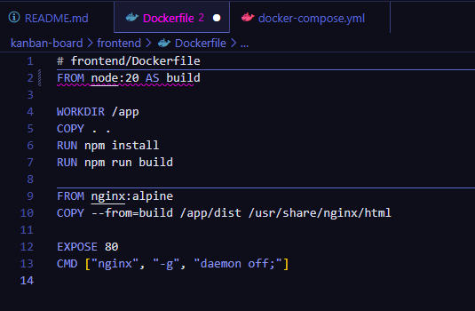

#### 2. Schritt - docker-compose.yml Datei angepasst

#### Inhalt:

````
  frontend:
    build: ./frontend
    ports:
      - "80:80"
    depends_on:
      - backend
````

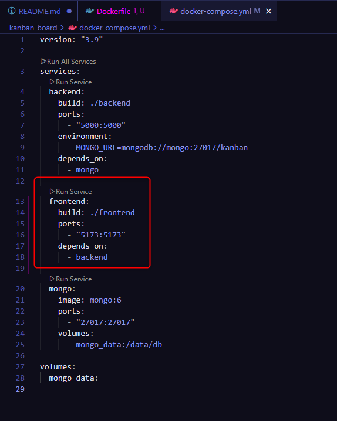
`
#### 3. Schritt - Docker starten 

Ich habe es efolgreich geschafft backend/frontend und mongoDB mit Docker zu starten

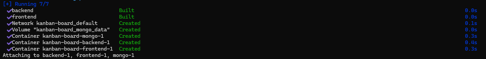
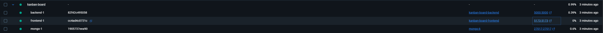

#### 4. Schritt - Website zugriff testen

Ich konnte mich erfolgreich auf die Website

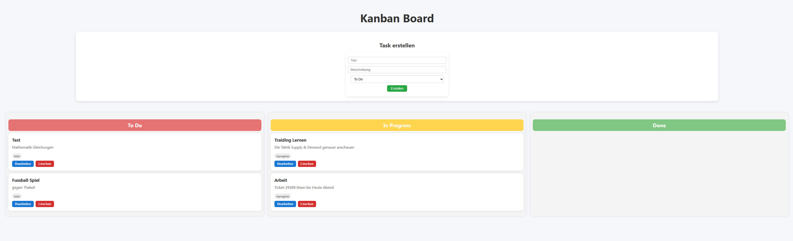


### Sprint 5 - Website Deployment auf AWS EC2

#### 5.1 - Docker Deployment auf AWS EC2

##### 1. Schritt - Projekt auf GitHub gepusht

Als erstes habe ich alle Änderungen auf mein GitHub-Repository gepusht:

````
git add .
git commit -m "Frontend integriert & Imports korrigiert"
git push
````
##### 2. Schritt - EC2-Instanz erstellen

- Ubuntu EC2 Instanz gestartet
- Sicherheitsgruppe erstellt mit Inbound-Regeln:
    - Port 22 (SSH)
    - Port 80 (HTTP)
    - Port 5000 (Backend, optional)
    - Port 5173 (Vite Dev, optional)

##### 3. Schritt - Cloud-Init (optional)

Beim Starten der Instanz habe ich folgendes Cloud-Init Skript verwendet:

````
#cloud-config
package_update: true
packages:
  - git
  - docker.io
  - docker-compose
runcmd:
  - systemctl start docker
  - systemctl enable docker
````

##### 4. Schritt - Repository

Ich musste überprüfen ob das Repository geklont wurde und das wurde es auch:

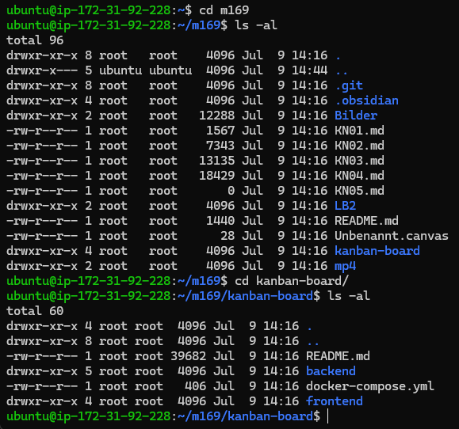


##### 5. Schritt - Docker Compose starten

**Befehl:**
````
sudo docker-compose up -d --build
````
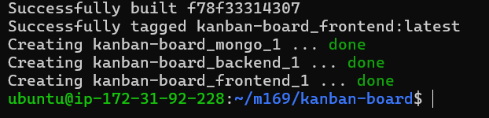

##### 6. Schritt - Webseite im Browser öffnen

Die Seite ist erreichbar unter:

http://44.194.82.214

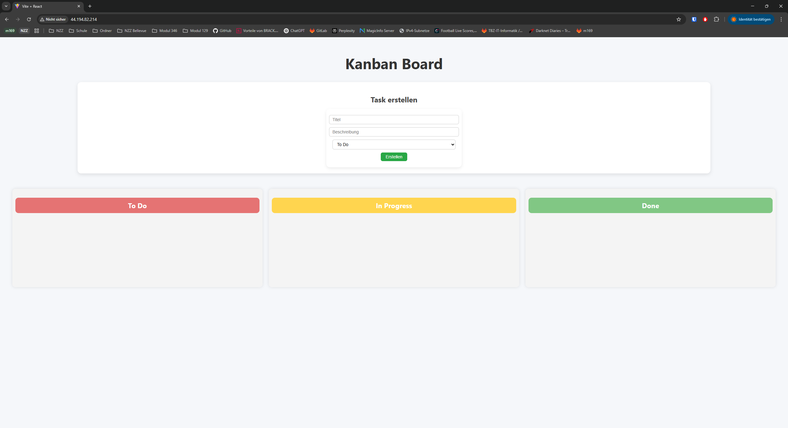

----

#### 7. Schritt - Kanban-Board funktioniert nicht

- Die Website wird angezeigt jedoch kann ich nichts erstellen oder machen
- Deswegen muss ich jetz die fetch("http://backend:5000/api/tasks") ändern auf fetch("http://44.194.82.214:5000/api/tasks")

Hier ein Beispiel von TaskForm.jsx änderung

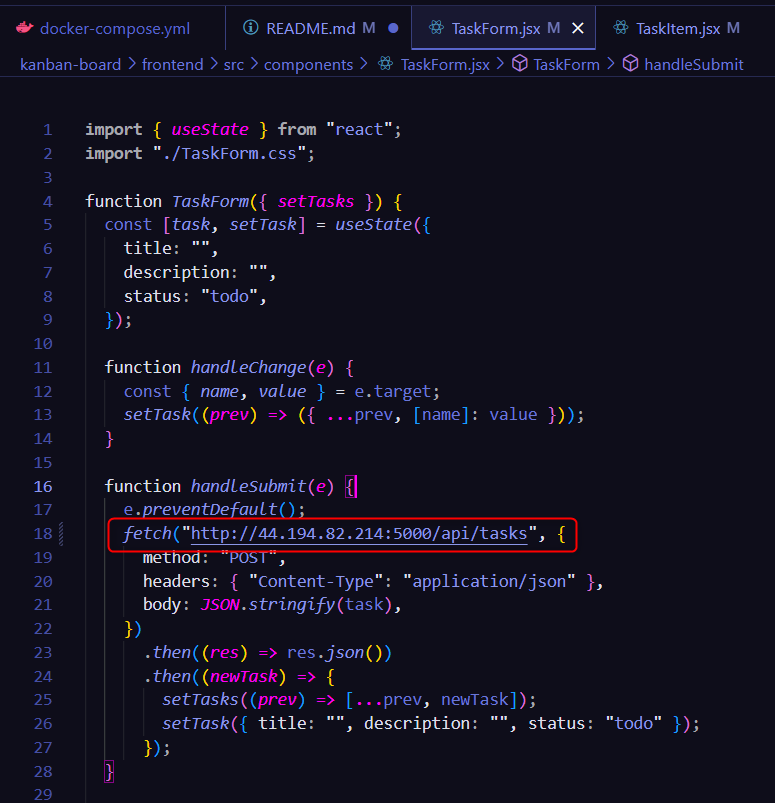


#### 8. Schritt - Kanban-Board funktioniert

Nun kann ich erfolgreich auf meiner EC2 Instance Task erstellen:

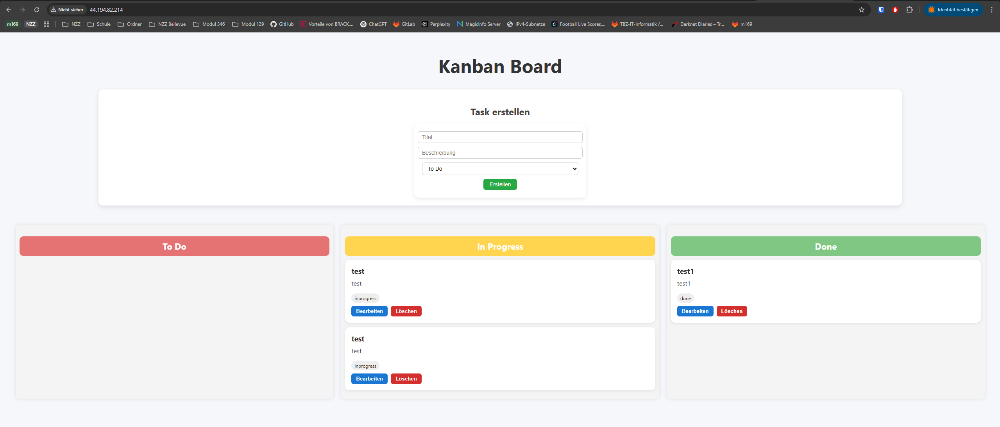

----

#### 9. Schritt - Domain hinzufügen

Jetzt habe ich auf noip eine Domain erstellt http://kanban-vuk.ddns.net/ mit der IP von der EC2 Instance

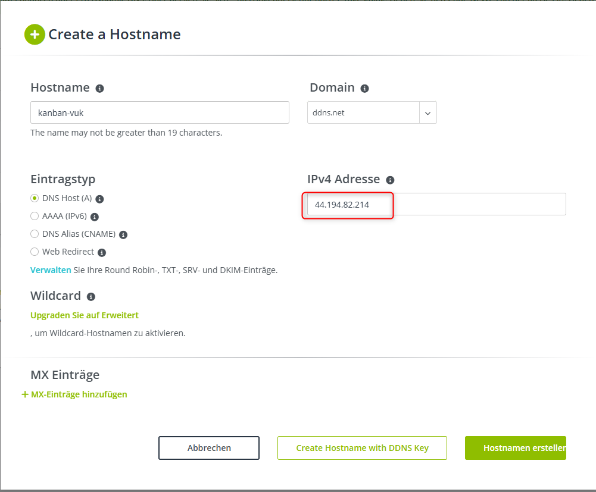

#### 10. Schritt

## Endprodukt

Hier sieht man mein Eroflgreiche Website Kanban board man kann task hinzufügen sie drag&drop die tasks verscheiben 


klicken Sie auf den GIF drauf um es besser zu sehen